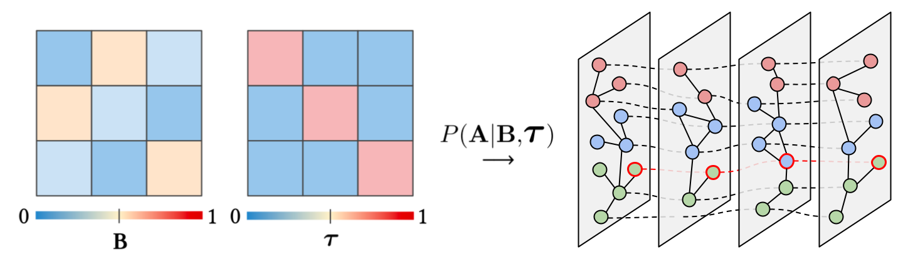

# TADC-SBM: a Time-varying, Attributed, Degree-Corrected Stochastic Block Model

This is the code repository for the accompanying paper:

> Passos, N.A.R.A., Carlini, E., Trani, S. (2025). [TADC-SBM: a Time-varying, Attributed, Degree-Corrected Stochastic Block Model](https://nelsonaloysio.github.io/files/tadcsbm.preprint.pdf). 2025 IEEE Symposium on Computers and Communications (ISCC), Bologna, Italy, 2025, pp. 1-6.

___

## About

TADC-SBM is a synthetic dataset generator based on [Ghasemian et al. (2016)](http://dx.doi.org/10.1103/PhysRevX.6.031005) and [Tsitsulin et al. (2021)](https://doi.org/10.48550/arXiv.2204.01376) that produces temporal graphs with varying community structures, attribute features, and mesoscale dynamics, suited for community detection and graph representation learning benchmarks under controlled experimental settings:

[]()

where $\mathbf{B}$ is the block matrix describing the probability of an edge being created among nodes in each community and $\boldsymbol{\tau}$ is the transition matrix with the probabilities of nodes switching communities over time.
Node- and edge-level attribute features are drawn from a multivariate distribution considering the node communities in either the first or the last graph snapshot, optionally representing hierarchical (nested) structures in the feature space.

## Requires

Requirements can be installed from [pypi (requirements.txt)](requirements.txt) or using [conda (environment.yml)](environment.yml).

> The [graph-tool](https://graph-tool.skewed.de/) library must be available in the user space: `conda install -c conda-forge graph-tool`.

## Usage

To import the generator function:

```python
from tadcsbm import tadcsbm_simulator
sbm = tadc_simulator(...)
```

An interactive example may be found in the included [notebook](notebook.ipynb) file.

### Command line

A command line interface is included to stremaline graph generation:

```none
usage: tadc-sbm.py [-h] -n NUM_VERTICES -e NUM_EDGES -k COMMUNITIES
                   [-t SNAPSHOTS] [--eta ETA] [--gamma {0,1}]
                   [--beta EDGE_SAMPLING_RATE] [--feature-dim FEATURE_DIM]
                   [--feature-center-distance FEATURE_CENTER_DISTANCE]
                   [--feature-cluster-variance FEATURE_CLUSTER_VARIANCE]
                   [--feature-groups FEATURE_GROUPS]
                   [--edge-feature-dim EDGE_FEATURE_DIM]
                   [--edge-center-distance EDGE_CENTER_DISTANCE]
                   [--edge-cluster-variance EDGE_CLUSTER_VARIANCE]
                   [--fix-probabilities] [--no-reverse] [--uniform-all]

options:
  -h, --help            show this help message and exit
  -n NUM_VERTICES, --num-vertices NUM_VERTICES
                        Number of vertices (nodes)
  -e NUM_EDGES, --num-edges NUM_EDGES
                        Number of edges per snapshot
  -k COMMUNITIES, --communities COMMUNITIES
                        Number of communities
  -t SNAPSHOTS, --snapshots SNAPSHOTS
                        Number of snapshots
  --eta ETA             Transition probability factor (0.0 to 1.0)
  --gamma {0,1}         Fix transition probabilities (default: 0 for current
                        memberships)
  --beta EDGE_SAMPLING_RATE
                        Edge sampling rate (0.0 to 1.0)
  --feature-dim FEATURE_DIM
                        Dimensionality of node features
  --feature-center-distance FEATURE_CENTER_DISTANCE
                        Distance between feature clusters
  --feature-cluster-variance FEATURE_CLUSTER_VARIANCE
                        Variance of feature clusters (default: 1.0)
  --feature-groups FEATURE_GROUPS
                        Number of feature groups (default: k)
  --edge-feature-dim EDGE_FEATURE_DIM
                        Dimensionality of edge features
  --edge-center-distance EDGE_CENTER_DISTANCE
                        Distance between edge feature clusters
  --edge-cluster-variance EDGE_CLUSTER_VARIANCE
                        Variance of edge feature clusters (default: 1.0)
  --fix-probabilities   Use fixed transition probabilities (default: False)
  --no-reverse          Keep the generation order of snapshots (default:
                        reversed)
  --uniform-all         Uniform transition probabilities (i.e., including
                        current community)
```

### Example

To generate graphs with the same configuration used in the experimental evaluation of the paper:

```none
./tadc-sbm.py --communities 8 \
              --snapshots 8 \
              --num-vertices 1024 \
              --num-edges 10240 \
              --eta 1 \
              --gamma 0 \
              --feature-dim 32 \
              --feature-center 6.0
```

> Varying the value of $\eta \in [0, 1]$ (`--eta`) produces snapshots with different community stability rates, while the value of $\gamma \in \\{0, 1\\}$ (`--gamma`) fixes the community transition probabilities for nodes in each snapshot.

The [output](output) files are saved in NetworkX-compatible (GraphML), NumPy, or PyTorch Geometric format.

## Acknowledgements

Google Research for the [graph embedding simulations](https://github.com/google-research/google-research/tree/master/graph_embedding/simulations) that TADC-SBM is based on.

## Cite

In case this repository is useful for your research, kindly consider citing:

```
@inproceedings{tadcsbm2025,
    author = {Reis de Almeida Passos, Nelson Aloysio and Carlini, Emanuele and Trani, Salvatore},
    booktitle={2025 IEEE Symposium on Computers and Communications (ISCC)},
    title={TADC-SBM: a Time-varying, Attributed, Degree-Corrected Stochastic Block Model},
    year={2025},
    volume={},
    number={},
    pages={1-6},
    keywords={Temporal Graphs, Community Detection, Stochastic Block Modeling, Graph Representation Learning},
    doi={XX.XXXX/ISCCYYYYY.YYYY.YYYYYYYY}
}
```